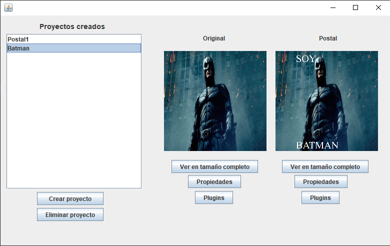
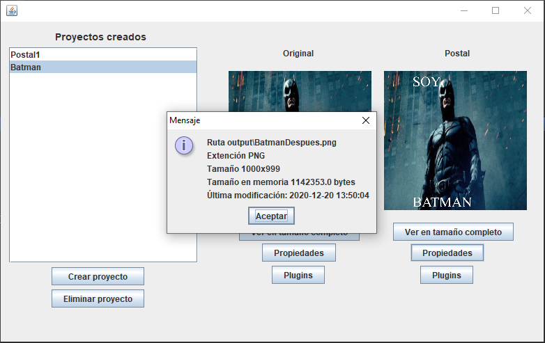
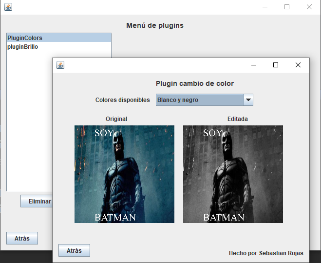
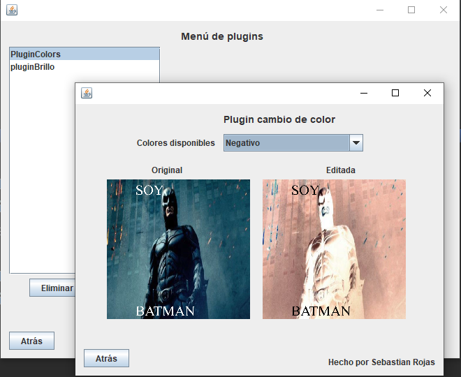

# Proyecto4Leng

## Acerca de
* Crear postales utilizando el [proyecto 1](https://github.com/SebastianRV26/GeneradorImagenesDeRecuerdo) en C.
* Almacendar dichas postales y mostrarlas.
* Cargar plugins con UI de manera dinámica.

## Menú de postales

## Plugins

Curso: Lenguajes de programación.
II Semestre 2020.
Profesor: Oscar Víquez Acuña.